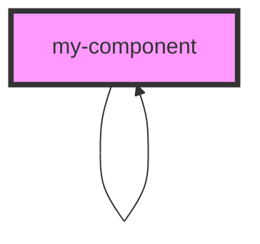

# my-component

<!-- Auto Generated Below -->

## Properties

| Property | Attribute | Description | Type    | Default     |
| -------- | --------- | ----------- | ------- | ----------- |
| `item`   | --        |             | `IItem` | `undefined` |

## Dependencies

### Used by

 - [my-component](.)

### Depends on

- [my-component](.)

### Graph

----------------------------------------------

*Built with [StencilJS](https://stenciljs.com/)*
